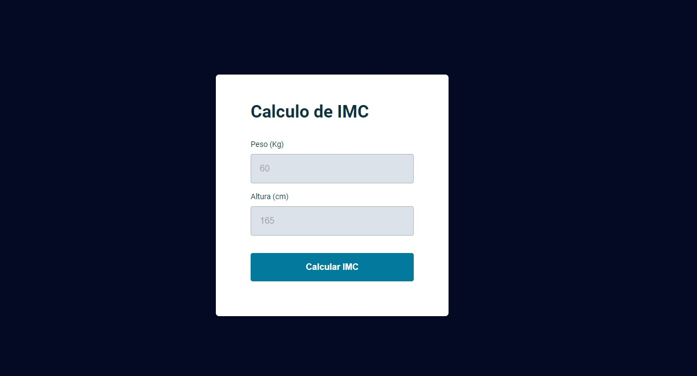

<h1 align="center"> Projeto Calculadora IMC </h1>

Projeto da trilha explorer rocketseat, de uma calculadora de IMC.

  <a href="#-tecnologias">Tecnologias</a>&nbsp;&nbsp;&nbsp;|&nbsp;&nbsp;&nbsp;
  <a href="#-projeto">Projeto</a>&nbsp;&nbsp;&nbsp;|&nbsp;&nbsp;&nbsp;
  <a href="#memo-licença">Licença</a>

  

 

  

## 🚀 Tecnologias

Esse projeto foi desenvolvido com as seguintes tecnologias:

- HTML e CSS
- JavaScript
- Git e Github

## 💻 Projeto

A Calculadora IMC é um projeto onde o usuario entra com seus dados de altura e peso e é calculado seu IMC por JavaScript.

## Licença

Esse projeto está sob a licença MIT.

---
